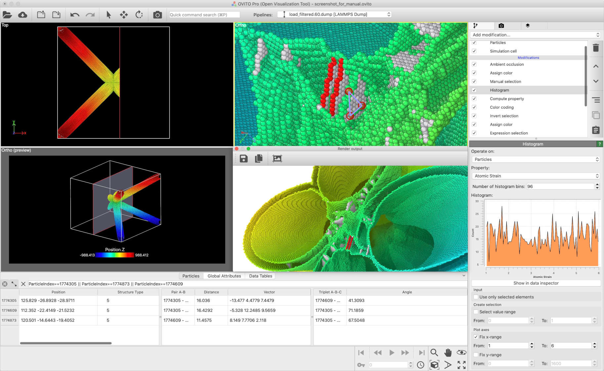

===========
About OVITO
===========

OVITO is a scientific visualization and analysis software for molecular and other particle-based dataset, typically generated by numeric simulation models in materials science, physics and chemistry disciplines. OVITO runs on Windows, Linux, and macOS. It is being developed by `OVITO GmbH <https://www.ovito.org>`_, a Germany-based spin-off company founded by the original lead developer `Dr. Alexander Stukowski <http://scholar.google.com/citations?user=f8Tw3eEAAAAJ>`_.
 
The first release of OVITO dates back to 2009 and has been described in `this paper. <http://stacks.iop.org/0965-0393/18/015012>`_
Please cite this reference when using OVITO in your research.

For further information, please visit the website `www.ovito.org <https://www.ovito.org>`_. 